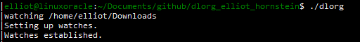
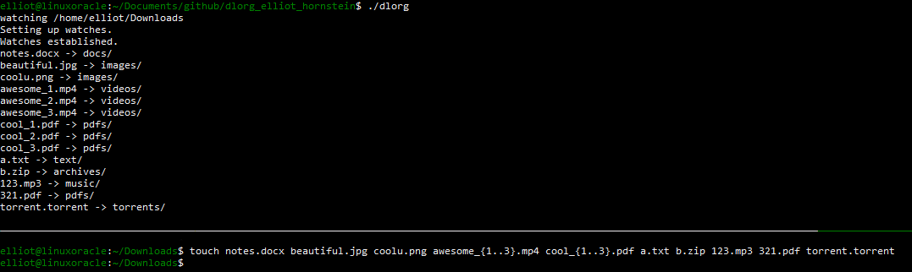
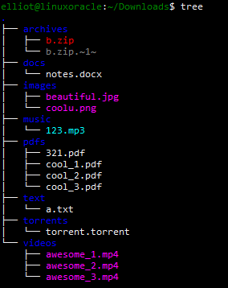
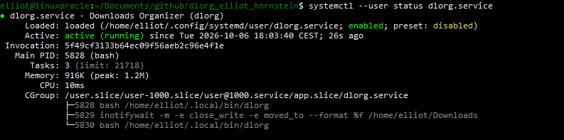

# dlorg – Download Organizer

Watches your `~/Downloads` folder and automatically sorts new files into
subfolders by file type.

## How it works

dlorg uses `inotifywait` to watch `~/Downloads`. When a file is finished
writing, is moved in, or is renamed there, it:

1. Looks at the file extension
2. Creates the target folder if it doesn't exist
3. Moves the file there

## Where files go

| Folder       | File types                               |
| ------------ | ---------------------------------------- |
| images       | jpg, jpeg, png, webp, gif, bmp, svg, ico |
| videos       | mp4, mkv, avi, mov, webm, flv, wmv       |
| music        | mp3, flac, wav, aac, ogg, m4a            |
| pdfs         | pdf                                      |
| docs         | doc, docx, odt, rtf                      |
| spreadsheets | xls, xlsx, ods, csv                      |
| archives     | zip, rar, 7z, tar, gz, bz2, xz           |
| torrents     | torrent                                  |
| text         | txt, md, log                             |
| other        | everything else                          |

## Requirements
`Linux`
```bash
sudo dnf install inotify-tools
```

## Quick start

```bash
git clone https://github.com/elliotdba26/dlorg_elliot_hornstein.git
cd dlorg_elliot_hornstein
chmod +x dlorg
./dlorg
```



## Tmux

In a second terminal (or a tmux split, `Ctrl-b` then `%`):

```bash
cd ~/Downloads
touch notes.docx beautiful.jpg coolu.png awesome_{1..3}.mp4 cool_{1..3}.pdf a.txt b.zip 123.mp3 321.pdf torrent.torrent
```





Moving files in works too, and deleted folders are recreated:

```bash
mv ~/Desktop/text.txt ~/Downloads/       # ends up in text/
rm -r ~/Downloads/images
touch ~/Downloads/image.png              # images/ is recreated
```

## Run in the background (systemd)

```bash
mkdir -p ~/.local/bin ~/.config/systemd/user
ln -s "~/dlorg_elliot_hornstein/dlorg" ~/.local/bin/dlorg
cp dlorg.service ~/.config/systemd/user/

systemctl --user daemon-reload
systemctl --user enable --now dlorg.service
```

Check status and watch it work live:

```bash
systemctl --user status dlorg.service
journalctl --user -u dlorg.service -f
```



Stop it with `systemctl --user disable --now dlorg.service`.
